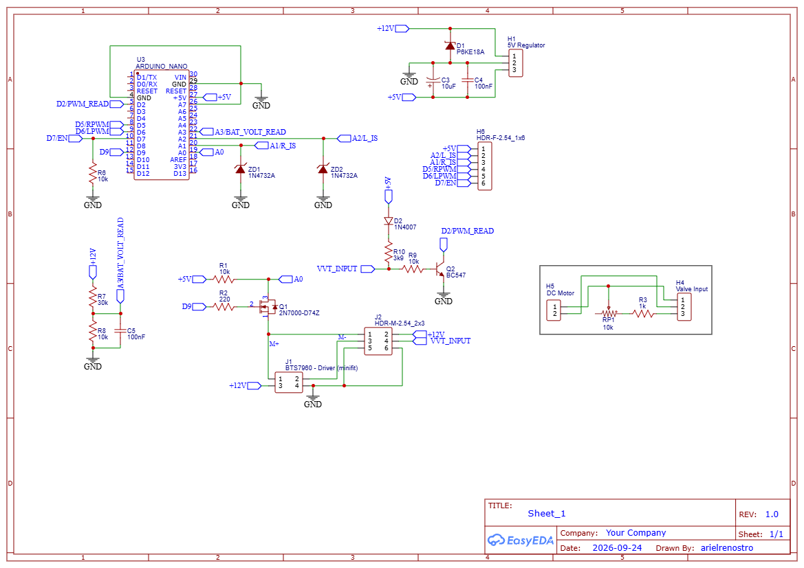

# Exhaust Valve Driver

PlatformIO firmware for an Arduino Nano that controls an exhaust valve
(butterfly) driven by a DC motor through a BTS7960 module, with position
feedback from a potentiometer and a target set by a 100Hz PWM signal coming
from the ECU.

The project's central challenge: **the position potentiometer and the motor
share the same physical wire**. A MOSFET multiplexes that wire between
"drive the motor" and "read the potentiometer signal", and the two can never
happen at the same time — doing so would fry the microcontroller. Practically
the entire architecture of this firmware exists to handle that constraint
safely.

## Table of contents

- [Hardware and pinout](#hardware-and-pinout)
- [The D7/D9 interlock](#the-d7d9-interlock)
- [Firmware architecture](#firmware-architecture)
- [State machine](#state-machine)
- [Bench-top target simulation](#bench-top-target-simulation)
- [Calibration (`include/config.h`)](#calibration-includeconfigh)
- [Build, upload and tests](#build-upload-and-tests)
- [Project structure](#project-structure)
- [Current status and next steps](#current-status-and-next-steps)

## Hardware and pinout

| Pin | Function |
|------|--------|
| `D2` | Reads the ECU's 100Hz PWM (opening target), non-blocking capture |
| `D5` | BTS7960 `R_PWM` |
| `D6` | BTS7960 `L_PWM` |
| `D7` | BTS7960 `R_EN` + `L_EN` (tied together) |
| `D9` | Enables the MOSFET that connects `A0` to the potentiometer |
| `A0` | Analog read of the position potentiometer (wire shared with the motor) |
| `A1` | BTS7960 `R_IS` — opening-direction current |
| `A2` | BTS7960 `L_IS` — closing-direction current |
| `A3` | Car battery voltage, via a resistive divider (30.1kΩ / 10kΩ) |
| `A4` | *(bench only, optional)* Potentiometer simulating the ECU PWM — see [Bench-top target simulation](#bench-top-target-simulation) |

> **Never enable `D9` together with `D7`.** Enabling the motor energizes the
> shared wire, making the `A0` reading invalid (and potentially dangerous for
> the analog pin). This rule is enforced in software by a single module
> (`ActuatorInterlock`) — nothing else in the firmware is allowed to touch
> `D5`, `D6`, `D7`, `D9` or `A0` directly.



## The D7/D9 interlock

Every position read requires turning the motor off, reading as fast as
possible, and only then turning it back on — never both at once:

```
|----- T_DRIVE_MS -----|---- settle ----|-- read ---|---- settle ----|----- next drive -----|
        D7=HIGH              D7=LOW        D9=HIGH        D9=LOW             D7=HIGH
    (motor running)     (motor stopped)   (A0 read)    (motor idle)
```

Current (`A1`/`A2`) isn't subject to this limitation — it's read directly
from the BTS7960 — so stall detection by current keeps working with the
motor running, including during homing.

## Firmware architecture

```
┌──────────────────┐     ┌──────────────────────────┐
│ PwmTargetReader  │     │    ActuatorInterlock     │
│ (D2, interrupt + │     │ (D7/D9 mutex, dead-time, │
│ watchdog Timer1) │     │    reverse direction)    │
└──────────────────┘     └──────────────────────────┘
          │                            │
            duty% / valid                drive() / readPositionRaw()
          v                            v
┌───────────────────────────────────────────────────────────────┐
│                     ValvePositionControl                      │
│       PID (POSITION mode) or dead-reckoning (TIME mode)       │
│ holding at stops · fail-safe (signal lost) · mid-travel fault │
└───────────────────────────────────────────────────────────────┘
            │                            │
              (re)homing                   events / telemetry
            v                            v
┌──────────────────────┐     ┌───────────────────────┐
│  HomingCalibration   │     │        Logger         │
│ (stop-to-stop sweep, │     │ Serial 115200, events │
│  min/max, timings)   │     │ + throttled telemetry │
└──────────────────────┘     └───────────────────────┘
```

Pure logic that's natively testable (no `Arduino.h`) lives in `lib/`:
`DutyMapping`, `CurrentSense`, `ModeSelection`, `DeadReckoning`,
`PositionDeadband`, `Pid`. Code that talks to hardware lives in `src/`.

## State machine

```
              POWER ON
                  |
                  v
      ┌──────────────────────┐
      │        HOMING        │<-----------------------------------+
      │  stop-to-stop sweep  │                                    |
      └──────────────────────┘                                    |
                  |                                               |
      records min/max(A0), t_open, t_close                        |
      picks MODE: POSITION (PID) or TIME (dead-reckoning)         |
                  |                                               |
                  v                                               |
      ┌──────────────────────┐                                    |
      │       RUNNING        │ overcurrent mid-travel              |
      │  target = duty(D2)   │ (cuts motor, re-homes               |
      │   holding at stops   │  automatically)                    |
      └──────────────────────┘------------------------------------+
                  |
           D2 signal invalid
                  v
      ┌──────────────────────┐
      │       FAILSAFE       │
      │ drives to and holds  │
      │      FULLY OPEN      │
      └──────────────────────┘
```

Since the valve has no return spring on either end, reaching a stop never
releases the motor — it keeps pushing at reduced force (`HOLD_DUTY_PERCENT`),
with current protection that reduces that force further (and logs an event)
if the holding current stays high for too long.

## Bench-top target simulation

Until a PWM generator (or the actual ECU) is available for testing, the
firmware can read the opening target from a **potentiometer on `A4`**
instead of the real PWM signal on `D2`. Controlled by a single flag in
`include/config.h`:

```cpp
constexpr bool SIMULATE_TARGET_WITH_POTENTIOMETER = true; // false = use the real D2
constexpr int TARGET_SIM_POT_MAX_COUNTS = 900;             // A0 reading that represents 100%
```

The `A4` reading is mapped from `0` to `900` (not the ADC's full 0-1023
scale) to `0-100%` opening — adjust `TARGET_SIM_POT_MAX_COUNTS` if your
potentiometer doesn't hit exactly 900. With the flag set to `true`, the
fail-safe for PWM signal loss (`D2` with no signal) is disabled, since
there's no equivalent "signal lost" condition for the potentiometer — the
firmware always treats the `A4` target as valid. The module responsible is
`src/TargetSource.*`, the only place in the code that decides which of the
two sources to use; the rest of the firmware (`ValvePositionControl`)
doesn't know or need to know which one is active.

Before installing in the car, remember to set the flag back to `false` (or
use the bench PWM generator / the real ECU).

## Calibration (`include/config.h`)

All calibration values are named, commented constants in `include/config.h`
— no "magic numbers" scattered through the logic. Already populated with
values measured on this hardware:

- BTS7960 current scale: `0.00V = 0A`, `4.0V = 3.4A`
- Battery voltage divider: `20.05V = 5V` at the pin (R1=30.1kΩ, R2=10kΩ)
- D2 duty mapping: `0% = open`, `100% = closed` (`INVERT_TARGET_DUTY = true`)

Still need bench calibration before going into the car:
`T_DRIVE_MS`, `T_BTS7960_TURNOFF_MS`/`T_READ_MOSFET_TURNOFF_US` (the
interlock's two dead-times — the BTS7960's in milliseconds per the
datasheet, the 2N7000 MOSFET's in microseconds, since it switches in
~10ns), stall current thresholds (`STALL_CURRENT_THRESHOLD_*_AMPS`), PID
gains, `HOLD_DUTY_PERCENT`, `HOLD_CURRENT_THRESHOLD_AMPS`, and the ADC
prescaler. See `openspec/changes/exhaust-valve-controller/design.md` for the
rationale behind each one.

## Build, upload and tests

Standard PlatformIO project — via VS Code + the PlatformIO extension, or the
CLI:

```bash
# build and flash the Nano
pio run -e nanoatmega328new -t upload

# serial monitor (115200 baud)
pio device monitor -b 115200

# run the pure-logic unit tests (no hardware needed)
pio test -e native
```

## Project structure

```
include/config.h          calibration constants (no Arduino.h dependency)
include/Pins.h             fixed hardware pinout
lib/PwmTargetReader/        non-blocking PWM capture on D2
lib/DutyMapping/            duty% -> opening target (0..1)
lib/CurrentSense/           ADC -> Amps (BTS7960 scale)
lib/ModeSelection/          picks POSITION vs TIME mode
lib/DeadReckoning/          time-based position estimator
lib/PositionDeadband/       position dead-band
lib/Pid/                    generic PID controller
lib/AnalogTargetMapping/    A4 ADC -> duty% (bench simulation)
src/ActuatorInterlock.*     the D7/D9 mutex (only place touching motor/sensor)
src/CurrentSensing.*        current (A1/A2) and battery voltage (A3) reading
src/TargetSource.*          switches between D2 (real PWM) and A4 (bench pot)
src/HomingCalibration.*     stop-to-stop sweep at startup
src/ValvePositionControl.*  main control loop
src/Logger.*                 serial log (events + throttled telemetry)
src/main.cpp                 wires everything together
test/test_native/            native unit tests (Unity), no hardware
openspec/                    proposal, specs, design and tasks for this implementation
```

## Current status and next steps

The firmware is implemented and builds clean (`pio run`), with 19 native
unit tests passing (`pio test -e native`) covering all the pure logic. What's
still missing is **bench verification with real hardware**: confirming on an
oscilloscope/multimeter that `D7`/`D9` never overlap, calibrating the
timings and current thresholds, and validating both control modes, holding
at the stops, the mid-travel fault, and the D2 signal fail-safe. The full
checklist is in
`openspec/changes/exhaust-valve-controller/tasks.md` (item 8.2).
